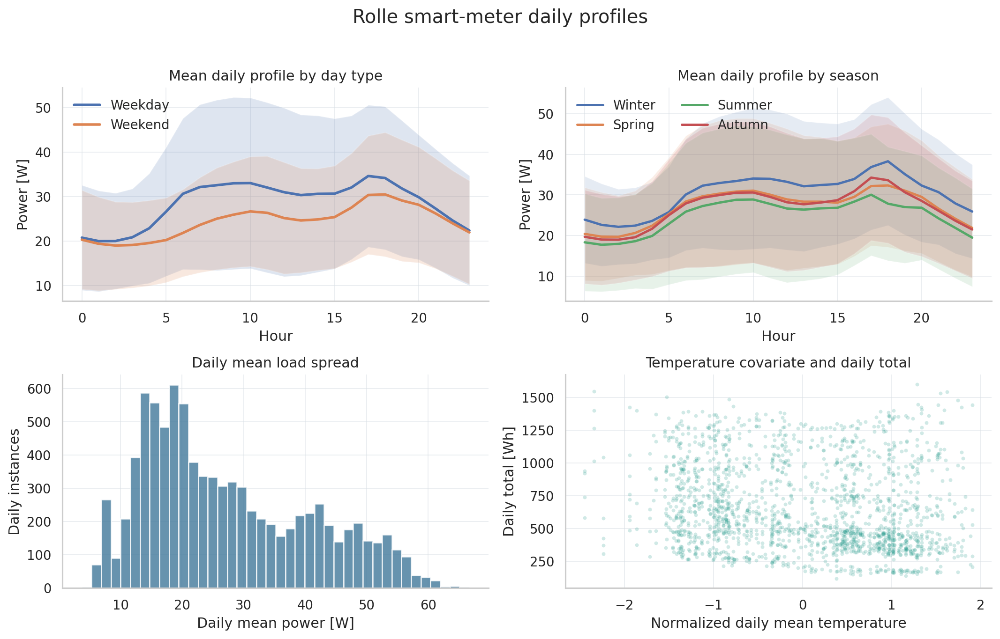
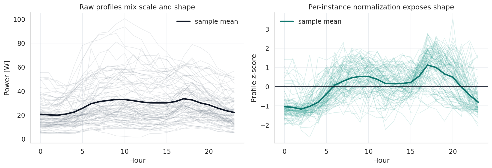
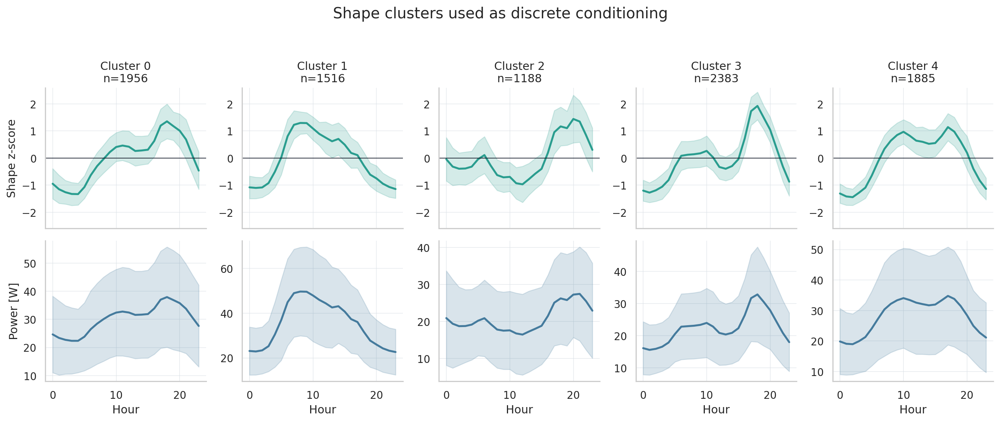
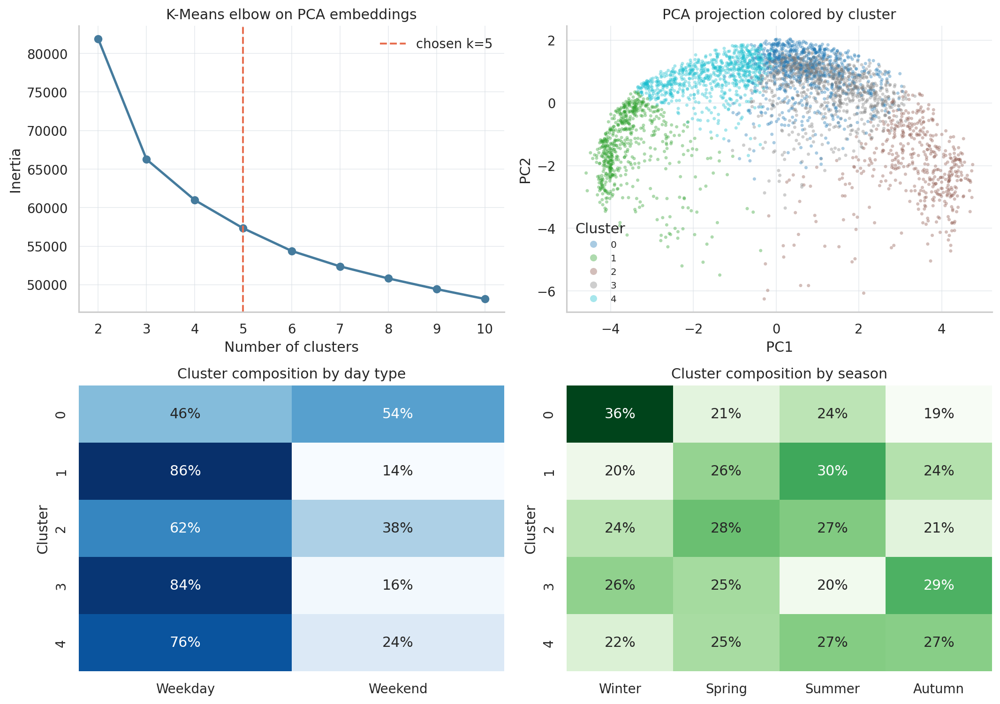
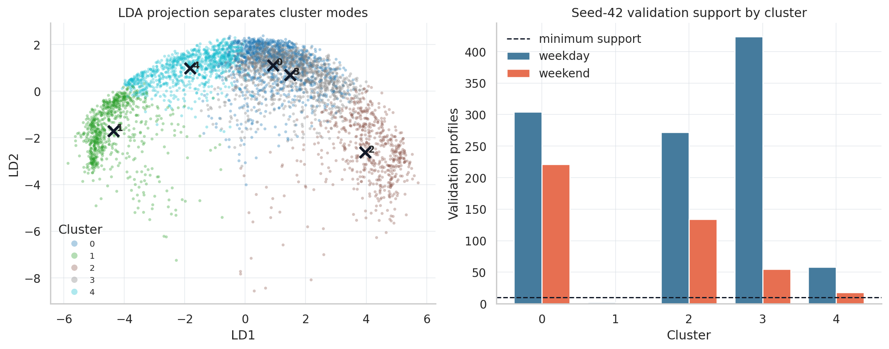
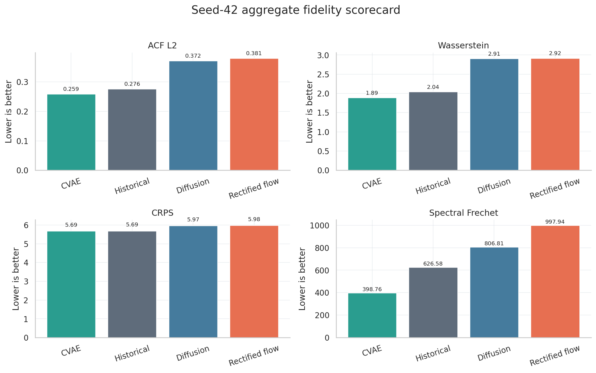
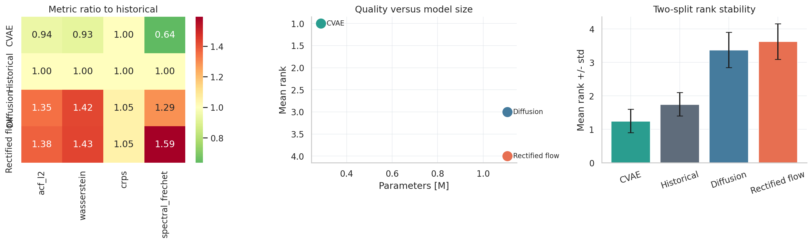
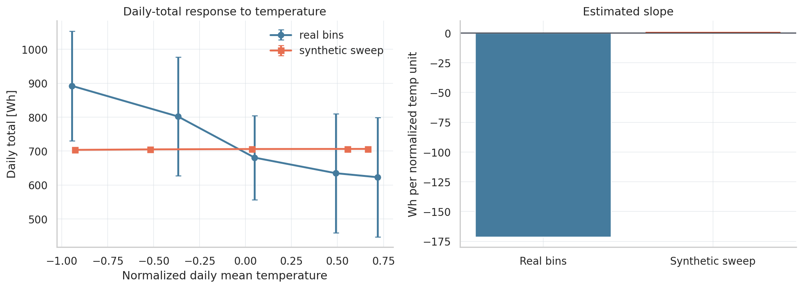

# Conditional Generative Models for Smart-Meter Load Profiles

Nicola Capacchione  
SUPSI DAS Tesina  
June 2026

## Executive Summary

This thesis studies conditional generation of synthetic daily smart-meter load profiles. The goal is not point forecasting, but sampling realistic 24-hour curves that match the distribution of real electricity demand under a given condition: cluster, day type, season, temperature, and scale.

The project compares a non-parametric historical retrieval benchmark with three learned generative models: a denoising diffusion model, a rectified-flow model, and a conditional beta-VAE. On the seed-42 thesis split, the conditional beta-VAE is the strongest learned generator. It wins all four aggregate fidelity metrics, uses only 0.286 million parameters, and remains the best learned model in the available meter-split robustness check. The historical baseline remains close, which is an important result: for a small one-year, 24-meter dataset, memorized historical retrieval is hard to beat.

The main limitation is temperature conditioning. Temperature is included explicitly, but season and the log-scale covariates already carry much of the temperature-related effect. The partial-dependence diagnostic shows that real daily totals fall strongly across warmer bins, while the generated response is much flatter when season and scale channels are held fixed.

## 1. Introduction: Generative Models for Load Curves

Generative models learn a data distribution so that new samples can be drawn from it. In this thesis, each sample is a daily electricity profile:

```text
x = [load_00, load_01, ..., load_23]
```

The conditional generation problem is to sample daily profiles from:

```text
p(profile | cluster, day_type, season, temperature, log_mean, log_std)
```

This is different from a usual forecasting task. A forecast often asks for one best estimate of tomorrow's load. A generator asks for a plausible ensemble of profiles: different possible shapes, peaks, valleys, and levels that could occur under the same condition. This matters because smart-meter data contains large irreducible variability. Two weekdays in the same season can have similar mean levels but different peak timing or shape.

The thesis compares four model families:

| Model | Role | Main idea |
| --- | ---: | --- |
| Historical retrieval | Benchmark | Sample real training days that match the requested condition. |
| Diffusion | Learned generator | Add noise during training and learn to denoise step by step. |
| Rectified flow | Learned generator | Learn a velocity field that transports noise into data. |
| Conditional beta-VAE | Learned generator | Encode profiles into a latent space and decode new latent samples under the requested condition. |

The central question is practical: which model gives the best distributional match to held-out smart-meter profiles, given this dataset size and conditioning design?

## 2. Thesis Work and Scope

The project uses the Rolle, Switzerland smart-meter and NWP weather dataset. The workflow is:

1. Load and clean the raw active-power data.
2. Convert hourly readings into one 24-hour profile per meter and day.
3. Normalize each profile to focus the models on shape rather than absolute load scale.
4. Cluster normalized shapes to define a discrete load-shape condition.
5. Train three conditional generative models with the same conditioning schema.
6. Compare them against a historical benchmark using functional distances and diversity diagnostics.
7. Check whether the conclusion is stable under an alternative held-out meter split.

The scope is intentionally narrow. The thesis does not claim causal temperature response, does not attempt broad architecture ablations, and does not evaluate many random seeds. It asks whether modern conditional generators are useful for this small smart-meter setting, and how they compare with a strong non-parametric baseline.

The locked conditioning schema is:

```python
c_discrete = [cluster_id, day_type, season]
c_continuous = [temp_normed, log_mean_z, log_std_z]
```

All learned models and the historical baseline are evaluated under this same schema.

## 3. Data and Preprocessing

The processed dataset contains 24 real smart-meter columns, after dropping aggregation columns from the original Rolle power-quality archive. The raw active power is resampled from 10-minute readings to hourly profiles. Each usable instance is one meter-day, so every profile has 24 time steps.

| Item | Value |
| --- | ---: |
| Meters retained | 24 |
| Daily instances | 8,928 |
| Calendar days per meter | 372 |
| Mean load range | 9.5-52.0 W |
| Maximum zero fraction | 0.0017 |

All meters are retained. The meter-quality diagnostic shows complete daily coverage, no structural missingness, and no all-zero meter. The dataset covers one annual cycle, from 2018-01-13 to 2019-01-19.



*Figure 1. Daily load structure by day type, season, load scale, and temperature. The profiles have clear daily shape and seasonal structure, but also substantial dispersion across meters and days.*

The raw profiles have a large scale spread across meters and days. If the models were trained directly in raw units, much of the loss would be spent learning amplitude differences rather than daily shape. The project therefore applies per-instance shape normalization:

$$
x_{norm} = \frac{x - \mu_x}{\max(\sigma_x, \epsilon)}
$$

The discarded scale is not lost. The log daily mean and log daily standard deviation are z-scored and passed back as continuous conditioning variables. This lets the model learn normalized shape while still allowing reconstruction in physical units.



*Figure 2. Raw profiles mix shape and amplitude; per-instance normalization gives the generative models a shape-learning task, with amplitude restored through log-scale covariates.*

## 4. Clustering and Conditioning

Shape clustering is used to give the generator a discrete summary of profile morphology. The pipeline is:

1. Normalize every daily profile to zero mean and unit variance.
2. Project profiles with PCA to 20 components.
3. Run K-Means with k=5 and seed 42.
4. Use the resulting `cluster_id` as one of the discrete conditions.

The choice k=5 is a compromise. It is small enough to keep condition groups populated, but rich enough to separate distinct daily shapes: flatter profiles, morning-heavy profiles, evening-peaking profiles, and mixed modes.



*Figure 3. Mean profiles by cluster. The top row shows normalized shape; the bottom row shows the same clusters in raw power units. Cluster identity captures shape, while scale remains partly independent.*

The clustering is not meant to replace day type, season, or temperature. It is a separate conditioning channel. The crosstabs show that clusters are not identical to calendar categories: some clusters are more common in particular seasons or day types, but no cluster is merely a relabeling of season or weekday/weekend.



*Figure 4. K-Means selection and cluster diagnostics. The PCA projection is not perfectly separated in two dimensions, but the cluster profiles and supervised LDA view show structured shape modes.*

The small-cluster issue deserves care. Cluster 1 is not small in the full dataset: it has 1,516 daily instances. The problem is validation support under the seed-42 meter split. Since validation is done by holding out complete meters, cluster coverage depends on which meters are held out. Under seed 42, cluster 1 has only two weekday validation examples and zero weekend validation examples, so notebook 05 excludes it from comparison metrics.



*Figure 5. LDA projection and seed-42 validation support. Cluster 1 exists as a real shape mode, but it is almost absent from the seed-42 held-out meters, so metrics for it would be statistically fragile.*

This is why the robustness study matters. With split seed 005, all 10 cluster-day-type groups are covered in notebook 05. The conclusion becomes more nuanced, because historical retrieval ties CVAE on mean rank in that split, but CVAE remains the best learned model and the best aggregate model across the two locally available splits.

## 5. Benchmark and Learned Models

### Historical Retrieval Benchmark

The historical model stores all training profiles. At generation time, it finds training days with the same `(cluster_id, day_type, season)` and similar continuous covariates, then samples from that pool. If too few examples are available, the temperature tolerance is relaxed.

This is a strong benchmark because it returns real profiles. It has no trainable parameters and no inductive bias, but it cannot invent genuinely new shapes and can fail on rare or unseen condition combinations.

### Diffusion Model

The diffusion model trains by corrupting a real profile with Gaussian noise and learning to predict the noise. Sampling starts from noise and repeatedly denoises the profile. The implementation uses a cosine noise schedule, a 1-D transformer backbone, and classifier-free guidance.

Conceptually:

```text
x_t = sqrt(alpha_bar_t) * x_0 + sqrt(1 - alpha_bar_t) * noise
loss = MSE(noise, predicted_noise)
```

Diffusion models are expressive, but sampling is comparatively expensive because it requires many denoising steps.

### Rectified Flow

Rectified flow learns a continuous transport from noise to data. Instead of predicting denoising noise at many discrete noise levels, it learns a velocity field along a linear path between data and noise:

```text
x_t = (1 - t) * x_0 + t * noise
velocity_target = noise - x_0
loss = MSE(predicted_velocity, velocity_target)
```

Sampling integrates an ordinary differential equation. It is usually faster than diffusion for a similar backbone.

### Conditional beta-VAE

The conditional beta-VAE encodes each profile into a latent vector and decodes from that latent vector plus the conditioning variables. During generation, a new latent vector is sampled from a standard normal distribution and decoded under the requested condition.

```text
loss = reconstruction_loss + beta * KL(q(z | x, c) || p(z))
```

The beta term regularizes the latent space. In this project, the CVAE is much smaller than diffusion and rectified flow, but it performs best on the aggregate fidelity metrics.

## 6. Evaluation Metrics

The evaluation compares distributions of curves, not one generated curve against one real curve. The four main fidelity metrics are computed in physical units and are lower-is-better.

| Metric | What it measures | Why it matters |
| --- | --- | --- |
| ACF L2 | Distance between average autocorrelation functions | Detects wrong temporal memory or jitter. |
| Marginal Wasserstein-1 | Average per-hour distributional distance | Detects level and spread mismatch at each hour. |
| CRPS | Probabilistic ensemble calibration | Rewards ensembles that are neither too narrow nor too diffuse. |
| Spectral Frechet | Distance in FFT-magnitude feature space | Detects wrong frequency content or shifted daily peaks. |

Notebook 05 also defines diversity metrics in shape-normalized space:

| Metric | Direction | Interpretation |
| --- | ---: | --- |
| Novelty | Higher better | Fraction of generated profiles not too close to the training set. |
| Coverage | Higher better | Fraction of validation profiles represented by the generated ensemble. |
| Intra-diversity | Higher better | Nearest-neighbor spread inside generated samples. |

The diversity metrics prevent a misleading conclusion where a model matches the mean profile but collapses to a small set of shapes. Historical retrieval has novelty near zero by construction, while learned models can produce novel profiles. In the recorded final scorecard, CVAE balances fidelity and diversity better than diffusion or rectified flow; diffusion and rectified flow are more novel, but their fidelity and coverage are weaker.

## 7. Main Results

The seed-42 comparison uses 8 of the 10 possible `(cluster, day_type)` groups. Cluster 1 is excluded because it has fewer than 10 validation examples. The headline result is clear: CVAE wins all four aggregate fidelity metrics.

| Model | ACF L2 | Wasserstein | CRPS | Spectral Frechet | Mean rank | Metric wins | Conditions |
| --- | ---: | ---: | ---: | ---: | ---: | ---: | ---: |
| CVAE | 0.259 | 1.888 | 5.689 | 398.8 | 1.0 | 4 | 8 / 10 |
| Historical | 0.276 | 2.041 | 5.692 | 626.6 | 2.0 | 0 | 8 / 10 |
| Diffusion | 0.372 | 2.908 | 5.968 | 806.8 | 3.0 | 0 | 8 / 10 |
| Rectified flow | 0.381 | 2.919 | 5.978 | 997.9 | 4.0 | 0 | 8 / 10 |



*Figure 6. Seed-42 aggregate fidelity scorecard. Lower is better for all four metrics. CVAE is first on ACF L2, Wasserstein, CRPS, and spectral Frechet distance.*

The historical baseline is close to CVAE on ACF L2 and CRPS, which is expected: it samples real historical days. CVAE's advantage is that it improves the aggregate fidelity score while still being a parametric generator, not a memorized retriever.

The training summary should be read as a convergence and scale table, not as a direct quality comparison. The three learned models optimize different objectives, so their losses are not comparable across families.

| Model | Train instances | Validation instances | Steps | Parameters [M] | Final validation loss |
| --- | ---: | ---: | ---: | ---: | ---: |
| Diffusion | 7,440 | 1,488 | 5,800 | 1.106 | 0.273 |
| Rectified flow | 7,440 | 1,488 | 5,800 | 1.106 | 0.738 |
| CVAE | 7,440 | 1,488 | 5,800 | 0.286 | 0.147 |



*Figure 7. CVAE improves most metrics relative to historical retrieval, has the best quality-size tradeoff, and remains the best aggregate model over the two available meter splits.*

The metric ratio table is especially useful for interpretation. Values below 1 mean improvement over historical retrieval. CVAE improves ACF L2, Wasserstein, and spectral Frechet, and is essentially tied on CRPS. Diffusion and rectified flow are worse than historical on all four aggregate fidelity metrics in the seed-42 run.

## 8. Temperature Dependence

Temperature is included as `temp_normed`, but it is not an isolated causal variable in this conditioning scheme. The model also receives `season`, `log_mean_z`, and `log_std_z`. These channels absorb much of the same information: winter days are colder, seasonal patterns affect load shape, and the log-scale variables directly encode daily amplitude.

Notebook 04 therefore uses a partial-dependence diagnostic. It holds the discrete condition and scale channels fixed, then sweeps normalized temperature. The real validation bins show a strong negative relationship between temperature and daily total: colder days have larger total load. The generated response is much flatter.



*Figure 8. Temperature partial dependence. Real validation bins fall from cold to warm days, while the synthetic sweep stays almost flat when season and scale channels are held fixed.*

This does not invalidate the main profile-generation result. It means that the learned models can match many distributional properties without learning a faithful continuous temperature response. For future temperature-sensitive applications, the conditioning design should be strengthened. Possible improvements include heating/cooling degree days, daily minimum and maximum temperature, temperature range, lagged temperature, or a 24-hour forecast-temperature sequence. Another option is to sweep temperature and scale covariates jointly rather than holding the log-scale channels fixed.

## 9. Robustness and Limitations

The baseline thesis split uses meter-split seed 42. A second completed split, seed 005, changes the held-out meters while keeping the same model families and conditioning schema. Across the two locally aggregated splits, the rank stability table is:

| Model | Splits | Mean rank | Rank std | First-place splits | Metric wins |
| --- | ---: | ---: | ---: | ---: | ---: |
| CVAE | 2 | 1.25 | 0.35 | 2 | 6 |
| Historical | 2 | 1.75 | 0.35 | 0 | 2 |
| Diffusion | 2 | 3.38 | 0.53 | 0 | 0 |
| Rectified flow | 2 | 3.62 | 0.53 | 0 | 0 |

The robustness result supports the main conclusion, but it also limits how strongly it should be phrased. CVAE remains the best learned model and the best aggregate model, but historical retrieval remains very competitive. In seed 005, historical retrieval ties CVAE on mean rank and wins some metrics. This is a useful warning: on small smart-meter datasets, simple memory-based baselines can be extremely strong.

The main limitations are:

- Only two meter splits are locally aggregated.
- The dataset covers one annual cycle and 24 meters.
- Small validation pools make some condition-level metrics noisy.
- The aggregate ranking weights all four fidelity metrics equally.
- Diversity metrics are informative but secondary to the available fidelity scorecard.
- Temperature response is partly confounded with season and scale covariates.
- No architecture ablation proves whether CVAE wins because of the latent bottleneck, parameter efficiency, regularization, or their combination.

## 10. Conclusions

The thesis result is that a conditional beta-VAE is the preferred learned generator for this Rolle daily-load setting. It gives the best seed-42 fidelity scorecard, has the smallest parameter count among the learned models, and remains the best learned model in the available robustness check.

The historical benchmark is a crucial part of the conclusion. It is not merely a weak baseline; it is competitive because the dataset is small and the validation conditions overlap strongly with historical training patterns. Any learned generator must beat this reference to justify its complexity.

Diffusion and rectified flow remain scientifically interesting, but in this implementation they do not outperform the simpler alternatives. Their extra expressiveness and parameter count do not translate into better aggregate functional distances on this dataset.

The practical conclusion is therefore conservative: for this one-year, 24-meter smart-meter dataset, CVAE offers the best balance of fidelity, compactness, and generative flexibility. Future work should focus less on adding larger generative models and more on improving conditioning, especially temperature response, and on expanding robustness across more meter splits or datasets.

## Reproducibility Notes

The report figures and compact tables were generated with:

```bash
python scripts/generate_report_artifacts.py
```

Primary artifacts used in the report:

- report figures in `output/report/figures/`
- `output/report/tables/*.csv`
- `output/05/results/model_scorecard.csv`
- `output/05/results/training_summary_table.csv`
- `output/05/results/skipped_conditions.csv`
- `output/robustness/results/model_rank_stability.csv`

## References To Complete

1. Rolle power-quality and NWP dataset, Zenodo 10.5281/zenodo.3463136.
2. Ho et al., Denoising Diffusion Probabilistic Models.
3. Song et al., Denoising Diffusion Implicit Models.
4. Liu et al., Rectified Flow.
5. Kingma and Welling, Auto-Encoding Variational Bayes.
6. Higgins et al., beta-VAE.
7. Gneiting and Raftery, probabilistic forecasting and CRPS.
